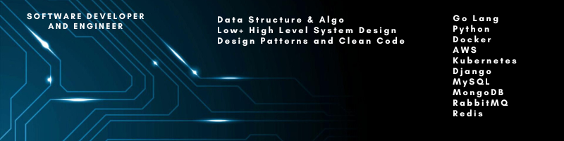

    

#### About Me

I am a **Software Developer and Engineer**. 
I had worked on design and development of software from scratch till production (fast, secure and scalable) while having well versed experience of owning and maintaining legacy code and software functioning since past 10 years.
Mainly the framework and tools I perfer as first options are **Django**, **Python 3**, **Go Lang**, **Docker**, **kubernetes**, **AWS Services**.

I also practice and preach good design principles, design patterns, clean code and timely refactoring and tech debt resolution.

#### Github Repositories and Work

- [Learn Linux](https://github.com/Py-Himanshu-Patel/Learn-Linux): All details and must have knowledge for a linux user.

- [Competetive Coding](https://github.com/Py-Himanshu-Patel/Competetive_Programming): All major data structures constructed using python. Also include some leetcode and popular interview questions.

- [Low Level Design](https://github.com/Py-Himanshu-Patel/LowLevelDesign): Working on Design Patterns, Clean Code, Refactoring and Low Level Design of some famous applications.

#### Meet me at

- [LinkedIn](http://www.linkedin.com/in/patelhimanshu18)
- <a href = "mailto: py.himanshu.patel@gmail.com">Email</a>
