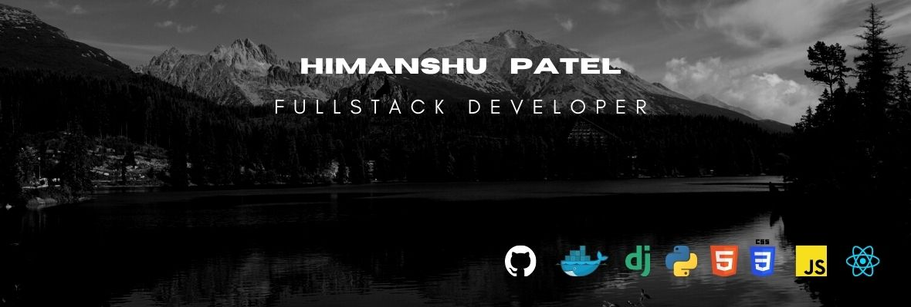

    

#### About Me

I am a passionate **FullStack Web Developer** specialized in backend mainly. I design API's (fast, secure and scalable). Using **Django** as framwork and **Python 3** as language. I also design fully responsive web websites using **React**.

<a style="vertical-align: middle" target='_blank' href="resume/Himanshu_Patel_Resume.pdf">
    <table>
        <tr>
            <td>Download Resume</td>
            <td>
                
            </td>
        </tr>
    </table>
</a>

<a href="https://whimsical.com/developer-map-CydNMWhc54Ya4vxkBZeec@2Ux7TurymNNKQwroNmHv">
  

      
  

</a>

#### Github Repositories and Work

- **Truck Sampark** (Private): Contributing in API development of a logistic product. Online bidding and load posting.

- **Track On** (Private): Designing database, API workflow, development and testing of API with documentation.

- [Learn Linux](https://github.com/Py-Himanshu-Patel/Learn-Linux): All details and must have knowledge for a linux user.

- [Competetive Coding](https://github.com/Py-Himanshu-Patel/Competetive_Programming): All major data structures constructed using python. Also include some leetcode and popular interview questions.

- [Django and Docker Integration](https://github.com/Py-Himanshu-Patel/Django_Docker_Integration): Integration django with docker and also introducing **python-decouple** library for securing access to secret resource in django project.

#### Meet me at

- [LinkedIn](http://www.linkedin.com/in/patelhimanshu18)
- <a href = "mailto: himanshu6443@gmail.com">Email</a>
