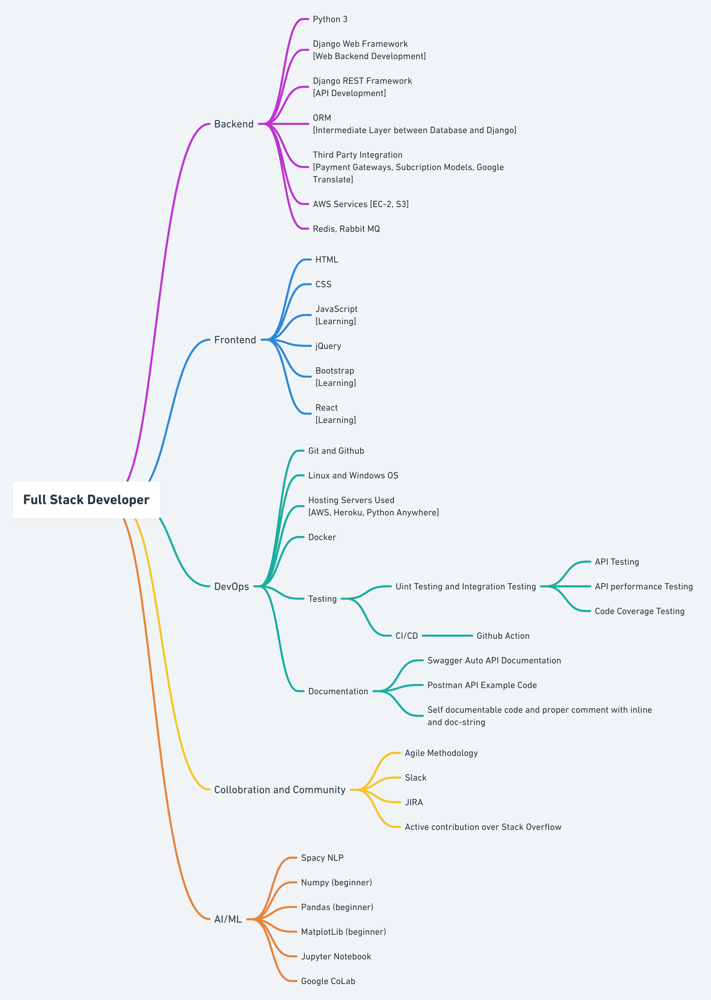

    

#### About Me

I am a passionate web developer specialized in backend mainly. During my internship I have designed backed for several production ready REST APIs from scratch till production using all industry defined standards and testing them throughly. Using **django** as framwork and **python** as language.

I also like to design fully responsive web websites from scratch till production. I have used **HTML**, **CSS** and **JS** but I consider myself still a beginner in frontend technologies.

All this with agile team environment over **JIRA** and daily scrum meet. In collobration with team over **Github** and **Slack**.

<a style="vertical-align: middle" target='_blank' href="resume/Himanshu_Patel_Resume.pdf">
    <table>
        <tr>
            <td>Download Resume</td>
            <td>
                
            </td>
        </tr>
    </table>
</a>

<a href="https://whimsical.com/developer-map-CydNMWhc54Ya4vxkBZeec@2Ux7TurymNNKQwroNmHv">
  

      
  

</a>

<!-- #### Programming Lanuguages

- Python (Proficient)
- JS (Begineer)

#### Framework and Technologies Skill Set

- ##### Web Backend and API

  - Django Web Framewotk
  - Django REST Framework
  - Postman

- ##### Deployment

  - Python anywhere
  - Heroku
  - AWS S3
  - Docker

- ##### Version control and team Collobration

  - Git and Github
  - JIRA
  - Slack -->

#### Github Repositories and Work

- **Truck Sampark** (Private): Contributing in API development of new product.

- **Track On** (Private): Designing API from scratch and designing database to user authentication and testing.

- [Competetive Coding](https://github.com/Py-Himanshu-Patel/Competetive_Programming): All major data structures constructed using python. Also include some leetcode and popular interview questions.

- [Django and Docker Integration](https://github.com/Py-Himanshu-Patel/Django_Docker_Integration): Integration django with docker and also introducing **python-decouple** library for securing access to secret resource in django project.

#### Meet me at

- [LinkedIn](http://www.linkedin.com/in/patelhimanshu18)
- <a href = "mailto: himanshu6443@gmail.com">Email</a>
